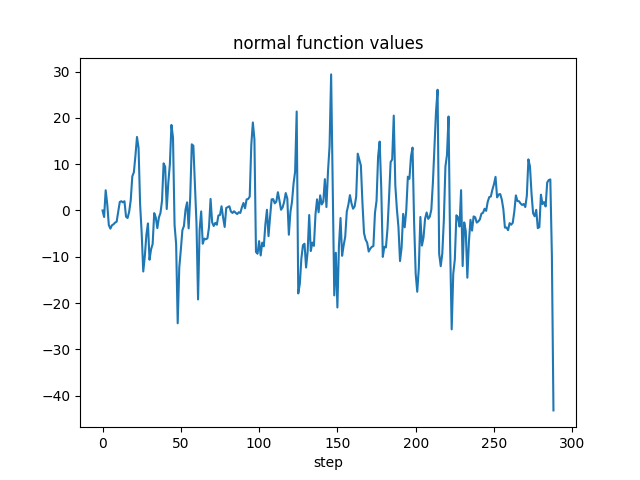
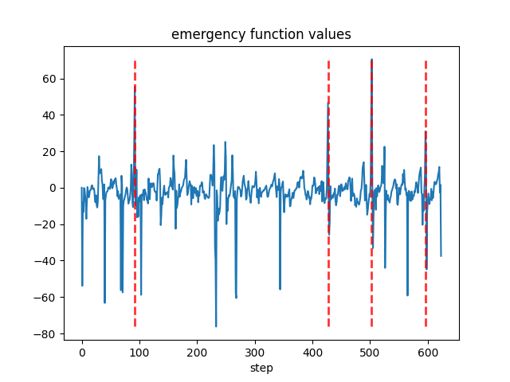
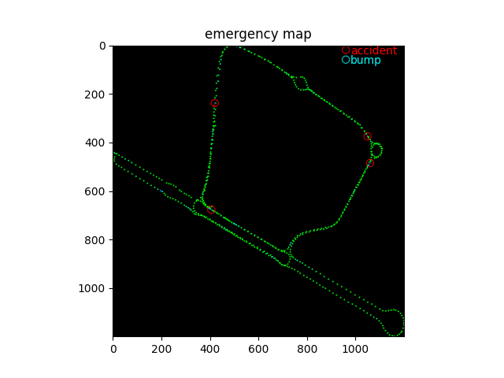
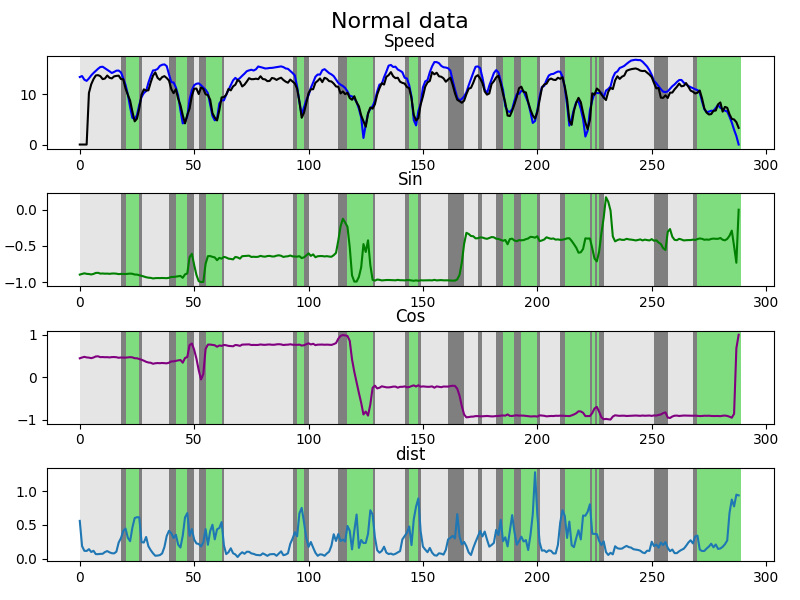
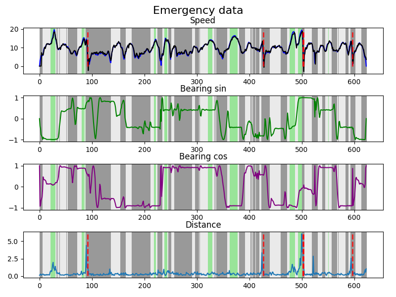

# sensor_analysis_SSC0715

This is a repository for my project for SSC0715. Sensor analysis to detect variation in the sensor data (IMU and GPS were used)

## Data description
The data was created by the professor responsible for SSC0715.

- Normal data:
  - Normal driving data;
  - Zero "accidents";
  - Bumbs partially detected (no labels provided).

- Emergency data:
  - Simulated accidents with agressive breaks;
  - Zig Zag to test the accident detection;
  - The handmade function was able to detect all accidents (the "label" in Dados-GPS-e-IMU-Emergency-Stop/Pontos-de-Destaque is wrong);
  - Didn't detect bumps (no labels provided).

## Handmade approach

Using the handmade algorithm it was possible to detect all "accidents" by considering the normal data as calibration. The threshold value was set to be higher than the max value of the normal function applied to the normal data.

To run the handmade method:
```
cd handmade_method
python plot.py
```

function used to detect accidents:
$$ f = \left( \frac{bearingDiffMean}{speedDiffMean}\right) \frac{s_1-s_2}{speedDiffMean} - \frac{|b_1-b_2|}{bearingDiffMean} $$


The core idea is to weight the velocity term and discount when the car is turning, as it is naturally reducing the velocity


If the function value is higher than a certain threshold, it is considered an accident.

### Function values and map
<p align="center">
  
</p>

<p align="center">
  
</p>

<p align="center">
  
</p>

## Unsupervised approach
Since the data wasn't enough data for a supervised approach, I tried to cluster each time step to detect the "accidents".

The data used was the speed and the sin and cos values from the Bearing angle (all data was from the GPS).

The KMeans method (n=3) was able to split the GPS data into stable high speed (white), transition (dark gray), stable or acceleration at low speeds (green).

To train the model and extract the features:
```
python main.py
```

A 1D convolutional neural network is trained to predict the next speed value to generate relevant features. After that, the method KNN-means is applied to the encoder features to classify each sequence step.

The "accidents" are marked according to the Handmade approach.

### Cluster example
<p align="center">
  
</p>

<p align="center">
  
</p>
