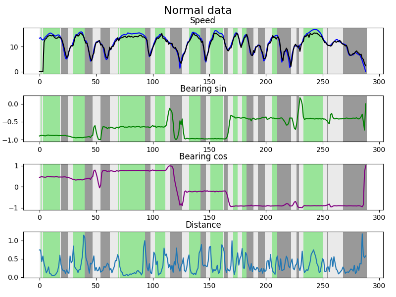
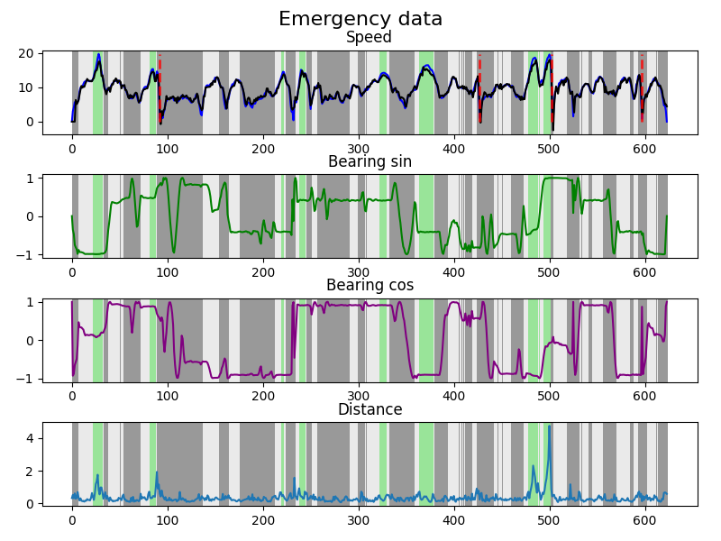
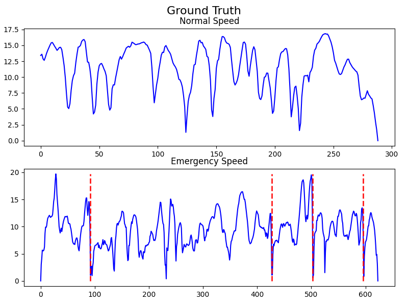

# sensor_analysis_SSC0715

This is a repository for my project for SSC0715. Sensor analysis to detect variation in the sensor data (IMU and GPS were used)

## Data description
The data was created by the professor responsible for SSC0715.

- Normal data:
  - Normal driving data;
  - Zero "accidents";
  - Bumps partially detected (no labels provided).

- Emergency data:
  - Simulated accidents with aggressive breaks;
  - Zig Zag to test the accident detection;
  - The handmade function was able to detect all accidents (the "label" in Dados-GPS-e-IMU-Emergency-Stop/Pontos-de-Destaque is wrong);
  - Didn't detect bumps (no labels provided).

## Handmade approach

Using the handmade algorithm it was possible to detect all "accidents" by considering the normal data as calibration. The threshold value was set to be higher than the max value of the normal function applied to the normal data.

To run the handmade method:
```
cd handmade_method
python plot.py
```

function used to detect accidents:
$$ f = \left( \frac{bearingDiffMean}{speedDiffMean}\right) \frac{s_1-s_2}{speedDiffMean} - \frac{|b_1-b_2|}{bearingDiffMean} $$


The core idea is to weight the velocity term and discount when the car is turning, as it is naturally reducing the velocity


If the function value is higher than a certain threshold, it is considered an accident.

### Function values and map
<p align="center">
  
</p>

<p align="center">
  
</p>

<p align="center">
  
</p>

## Unsupervised & Supervised approach

Unsupervised and supervised methods were compared to the handmade approach. The model was trained to predict the next speed given a window-sized input of the speed and bearing angle in the form of ```sin``` and ```cos``` functions.

This model was then used to cluster the data and to initialize the weights of the supervised model.

The KMeans method (n=3) tries to split the extracted features into top transition (green), acceleration (white), and deceleration (gray).

For the supervised approach, it was used binary cross entropy with weights 1,6 for the non-accidents and accidents, respectively. Only the first 550 steps of the emergency data was used.

The model is made by a 1D convolutional encoder followed by a couple of fully connected layers.

To train the model, extract the features and classify the accidents:
```
python main.py
```

The "accidents" are marked according to the Supervised approach.

Evaluating the centroid distance to the extracted features, it is possible to notice that the "accidents" couldn't fit nicely in a specific class, but it is not regular enough to be considered as a good estimate for accident detection.

### Output example
<p align="center">
  
</p>

<p align="center">
  
</p>

<p align="center">
  
</p>
